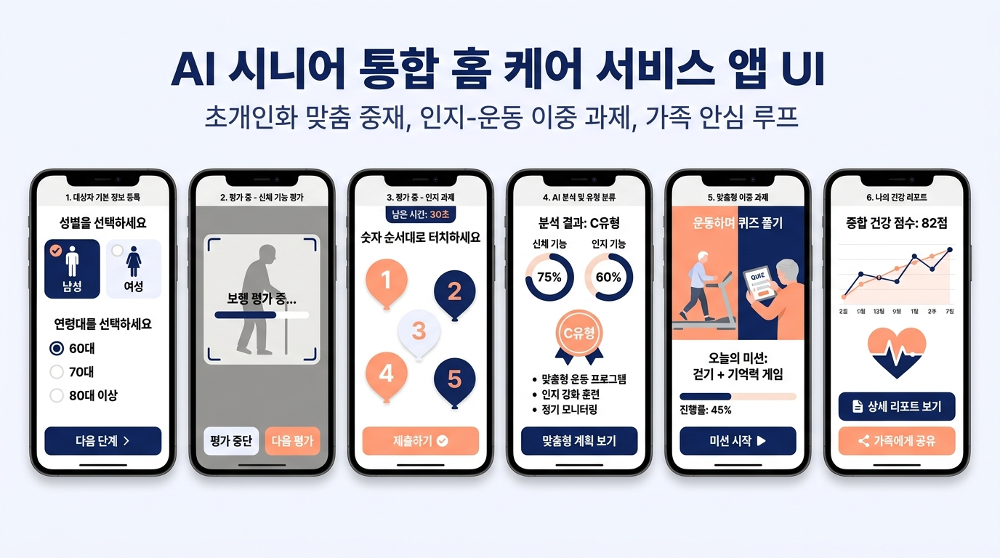
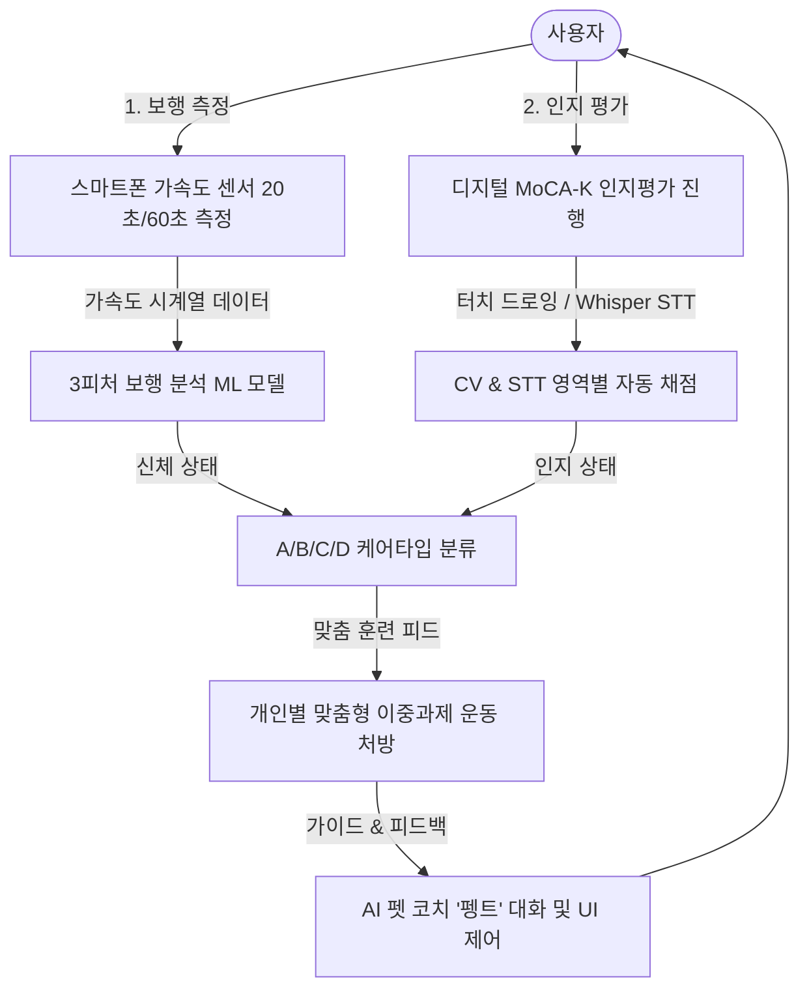
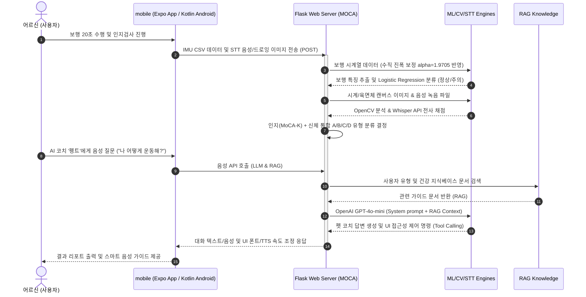
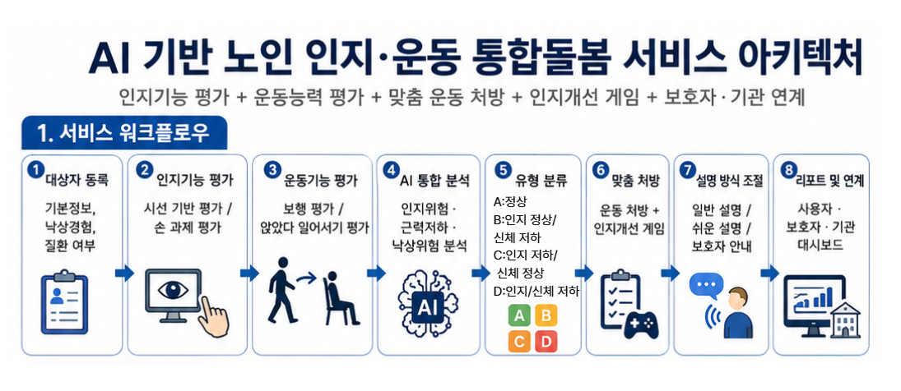

# 기억하지 (KIEOKHAJI)

> **인공지능(AI) 기반 노인 인지·신체 통합 선별 및 개인 맞춤형 이중과제 운동 제공 서비스**  
> **Clinical Clinical-Reasoning × Digital Healthcare AI Platform**

<p align="center">
  
</p>

---

## 🚀 Quick Links
- **[Clinical × AI Perspective](#13-clinical--ai-perspective)**: 임상 지식과 AI 기술의 융합 전략
- **[System Architecture](#06-system-architecture)**: 인지·보행 평가 및 AI 펫 코치 통합 흐름
- **[AI / Data Pipeline](#07-ai--data-pipeline)**: 보행 분석 피처 추출 및 ML 검증 지표 (`AUC 0.866`)
- **[Disclaimer & Copyright](#15-copyright--disclaimer-moca)**: MoCA 저작권 관련 면책 고지

---

## 01. Project Overview
노년기 삶의 질을 위협하는 양대 요인인 **치매(경도인지장애, MCI)**와 **낙상(신체 기능 저하)**은 임상적으로 밀접하게 연관되어 있습니다. 하지만 기존 헬스케어 서비스는 인지와 신체를 파편화하여 개별 평가·관리함으로써 고령자 통합 예방 관리에 한계를 보였습니다.

**'기억하지(KIEOKHAJI)'**는 스마트폰만으로 간편하게 **보행(신체)기능 평가(IMU 가속도 시계열 분석)**와 **인지기능 평가(MoCA-K 자동 채점)**를 수행하고, 사용자의 기능을 A/B/C/D 4개 군으로 통합 분류합니다. 이를 바탕으로 고령자에게 필수적인 **개인 맞춤형 이중과제(Dual-Task) 운동 프로토콜**을 추천하고, 대화형 **AI 펫 코치(RAG & Agentic AI)**를 통해 지속적인 가정 내 자기주도 관리를 유도하는 고령자 맞춤 디지털 헬스케어 플랫폼입니다.

---

## 02. Background & Problem
- **초고령사회와 사회적 비용**: 급격한 고령화로 인해 치매 및 낙상 사고율이 급증하고 있으며, 조기 선별과 지속 관리를 위한 의료·사회적 비용이 눈격하게 증가하고 있습니다.
- **인지와 신체의 상관성**: 의학적으로 걷는 행위는 고도의 인지 자원(Executive Function)을 소모합니다. 보행 속도 저하와 불안정성 증가는 치매 전조 증상(MCI) 및 낙상 위험의 핵심 바이오마커(Digital Biomarker)입니다.
- **기존 서비스의 한계**: 병원 방문 기반 평가의 접근성 한계, 그리고 단순 신체 운동 혹은 두뇌 퀴즈에 머물렀던 획일적 홈트레이닝 서비스는 인지·신체가 결합된 실생활 적응력을 향상시키는 데 한계가 있었습니다.
- **가정 내 지속 가능한 선별 예방 필요**: 노인들이 거부감 없이 일상적으로 자신의 상태를 측정하고, 흥미를 잃지 않고 예방 훈련을 지속할 수 있는 사용자 친화적인 도구가 부족했습니다.

---

## 03. Solution
'기억하지' 서비스의 핵심 평가는 **인지와 신체 데이터의 병렬적 획득 및 통합 분석**에서 시작하여 **맞춤 솔루션 제공**으로 귀결됩니다.



---

## 04. Key Features

### 1️⃣ IMU 가속도 센서 기반 보행(신체) 스크리닝
- **간편한 측정 프로토콜**: 스마트폰을 벨트나 허리 뒤쪽에 착용하고 20초~60초간 가볍게 걷는 것만으로 보행 생체 지표(Digital Biomarker) 수집.
- **실시간 축 정렬 및 신호 처리**: 센서 부착 기울기 오차 보정을 위한 수직(V), 좌우(ML), 전후(AP) 중력축 정렬 및 0.6~3.0 Hz Butterworth 밴드패스 필터 적용.
- **물리적 보행 특징 추출**: 수직 충격 강도(`v_jerk_rms_median`), 충격 변동성(`v_jerk_rms_iqr`), 보행 리듬 일관성(`v_harmonic_ratio_iqr`) 3가지 도메인 대표 피처를 활용하여 다중공선성(VIF)을 통제한 추론 모델 구동.
- **기기 간 편차 보정 (Domain Calibration)**: 연구 데이터셋(PhysioNet)과 실 스마트폰 측정 신호의 진폭 차이를 보정하기 위해 수직축 원시 신호에 진폭 보정계수($\alpha = 1.9705$)를 반영하는 도메인 캘리브레이션 구현.

### 2️⃣ 디지털 MoCA-K 인지평가 자동화
- **손그림 자동 채점 (Computer Vision)**: OpenCV 기반 영상 기하학 분석 알고리즘과 U-Net(DeepC/DeepH) 세그멘테이션 딥러닝 모델의 하이브리드 폴백 구조를 통해 터치 드로잉(길 만들기, 육면체 그리기, 시계 그리기)을 1초 내 자동 채점.
- **구술 및 언어 평가 자동화 (Fuzzy STT)**: Whisper STT를 이용해 말로 푸는 문항(이름대기, 기억력, 주의력, 언어 유창성, 추상력, 지남력)을 전사하고, 고령자 음성 오인식률을 보완하기 위해 문자열 유사도 분석(`SequenceMatcher >= 0.65`) 및 도메인 사전을 통한 Fuzzy 매칭 채점.
- **버전 자동 로테이션**: 인지 평가의 기억 효과(Learning Effect)를 방지하기 위해 6개월 단위로 K-MoCA와 MoCA-K 단어 및 과제를 자동 교체하는 버전 관리 엔진 탑재.

### 3️⃣ LLM & RAG 기반 어시스턴트 (AI 펫 코치 '펭트')
- **동적 앱 접근성 제어 (Tool Use/Function Calling)**: OpenAI GPT-4o-mini API를 기반으로 사용자가 "글자가 안 보여", "말이 너무 빨라"라고 말하면 AI 펫 코치가 발화를 해석하여 UI의 글자 크기를 키우거나 스마트폰 TTS 재생 속도를 동적으로 제어.
- **고령자 맞춤 대화 및 가이드**: 시니어 전용 RAG(Retrieval-Augmented Generation) 지식베이스를 연동하여 안전 운동 수칙, 보행 및 인지 점수의 쉬운 해석, 보호자 보고서 요약을 따뜻하고 친근한 사투리/펫 페르소나로 대화 안내.

### 4️⃣ 임상 기반 이중과제(Dual-Task) 운동 추천 및 모니터링
- **A/B/C/D형 맞춤 분류**: 인지와 신체 평가 결과를 교차하여 4가지 관리 방향 설정.
- **오타고 운동 프로토콜 결합**: 하지 근력 및 동적 균형 강화 운동(뉴질랜드 Otago Exercise Program 기반)을 하면서 동시에 인지 자극 퀴즈(단어 외우기, 거꾸로 세기 등)를 푸는 이중과제 운동 시나리오 및 멀티미디어 가이드 제공.
- **보호자 대시보드 (Web UI)**: 노인의 일일 훈련 기록, 기능 점수 변화 추이 추적, 원격 응원 메시지 전송 기능 탑재.

---

## 05. User Classification
인지 및 신체 기능을 융합하여 총 4개 유형으로 정교하게 분류하여 표적 관리를 시행합니다.

| 분류 유형 | 인지 기능 (MoCA-K) | 신체 기능 (IMU Gait) | 추천 관리 방향 및 훈련 솔루션 |
| :---: | :---: | :---: | :--- |
| **A 유형 (건강유지형)** | **정상** ($\ge 23$점) | **정상** (확률 $< 0.50$) | **기능 예방/유지**: 고난도 복합 이중과제 훈련 및 건강 증진 운동 |
| **B 유형 (인지관리형)** | **MCI 의심** ($< 23$점) | **정상** (확률 $< 0.50$) | **인지 자극 강화**: 신체 활동 중 기억력, 유창성 과제를 집중 수행하는 뇌-신체 활성화 솔루션 |
| **C 유형 (신체관리형)** | **정상** ($\ge 23$점) | **운동저하 주의** ($\ge 0.50$) | **신체 기능 강화**: 오타고 운동 기반 하체 근력 및 균형 중심 이중과제 훈련 |
| **D 유형 (통합관리형)** | **MCI 의심** ($< 23$점) | **운동저하 주의** ($\ge 0.50$) | **안전 중심 통합 케어**: 보호자 동반 하에 낙상 위험이 극도로 낮은 착석 상태 중심의 기초 이중과제 및 환경 점검 |

---

## 06. System Architecture



---

## 07. AI / Data Pipeline

### 1) Input Data & 전처리 (Gait IMU)
- **수집 장치**: 스마트폰 내장 가속도 센서 (Vertical, ML, AP 3축)
- **샘플링 주파수**: 100 Hz 리샘플링 (선형 보간법 활용)
- **도메인 캘리브레이션 (Amplitude Correction)**:  
  일상생활 데이터셋(PhysioNet) 기준 정상군 수직 가속도 RMS 중앙값($0.1939\text{ g}$) 대비 스마트폰 앱 정상군 측정 중앙값($0.0984\text{ g}$)의 진폭 배율 비율을 산출하여 원시 신호에 배율 $\alpha = 1.9705$ 보정 계수 적용.
  $$\text{Acc}_{\text{Vertical\_corrected}} = \text{Acc}_{\text{Vertical}} \times 1.9705$$
- **필터링**: $0.6\text{ Hz} \sim 3.0\text{ Hz}$ Butterworth 4차 대역통과 필터 적용 (보행 주기 집중 분석).
- **슬라이딩 윈도우**: 20초 보행 구간 내에서 10초 윈도우 슬라이딩 (Step = 2초, 총 6개 윈도우 특징 추출 후 Median Pooling 적용).

### 2) 특징 엔지니어링 (Feature Engineering)
- **`v_jerk_rms_median`** (수직 Jerk RMS 중앙값): 보행 중 가속도 변화량의 제곱평균제곱근(RMS). 걸음의 거칠기를 나타내며 낙상위험군일수록 높음.
- **`v_jerk_rms_iqr`** (수직 Jerk RMS 사분위범위): 충격 변화의 시간적 변동성. 보행 리듬의 불규칙성이 높을수록 상승.
- **`v_harmonic_ratio_iqr`** (수직 Harmonic Ratio IQR): 좌우 발걸음 대칭성의 시간적 일관성. 보행 주기 대칭성(Harmonic Ratio)이 매 걸음마다 흔들릴수록 상승.

### 3) 머신러닝 모델 성능 및 검증 지표
- **훈련 데이터셋**: PhysioNet 75h 고령자 일상 보행 데이터 (총 71명; 정상 31명, 저하 40명)
- **임상 라벨 정의 (Expanded Clinical OR Label)**:  
  단순 낙상 이력이 아닌, 임상적 이동·균형 기능 저하 지표의 조작적 정의 반영:
  $$\text{Label}_{\text{Impaired}} = \text{TUG} \ge 12\text{s} \lor \text{FSST} \ge 15\text{s} \lor \text{BERG} < 52 \lor \text{DGI} \le 19 \lor \text{Base Velocity} < 1.0\text{ m/s} \lor \text{S3 Velocity} < 1.0\text{ m/s}$$
- **교차 검증**: StratifiedGroupKFold (5-fold, 100회 반복, Subject-level Leakage 완전 방지)
- **최종 모델**: **Logistic Regression (L2 정규화, C=1.0)**
- **평가 성과 지표** (선별 목적 Screening Threshold = 0.50 고정 기준):
  
  | 검증 지표 | Train Fold 평균 | Test Fold 평균 (OOF) | Overfitting Gap |
  | :--- | :---: | :---: | :---: |
  | **AUC** | 0.892 | **0.866 $\pm$ 0.009** | 0.026 |
  | **Sensitivity (민감도)** | 0.845 | **0.829 $\pm$ 0.021** | 0.017 |
  | **Specificity (특이도)** | 0.751 | **0.736 $\pm$ 0.027** | 0.015 |
  | **VIF (다중공선성)** | - | **1.54 $\sim$ 2.17** | 다중공선성 없음 (< 5.0) |

> 💡 **최종 모델 선정 이유**: XGBoost, SVM, CNN1D 등 타 알고리즘과 비교 실험 결과, Test AUC 최고점 획득 및 Train-Test 성능 Gap이 가장 작아($<0.03$) 소표본(n=71)에서의 일반화 능력이 우수하고 설명 가능성이 높아 최종 로지스틱 회귀 모델로 채택.

---

## 08. Tech Stack
<div align="left">
  <!-- Python -->
  
  <!-- Flask -->
  
  <!-- PyTorch -->
  
  <!-- Scikit-Learn -->
  
  <!-- OpenCV -->
  
  <!-- OpenAI (GPT & Whisper) -->
  
  <!-- React Native (Expo) -->
  
  <!-- Kotlin (Android Native) -->
  
  <!-- SQLite3 -->
  
</div>

- **AI / ML**: Python, PyTorch (U-Net CNN), Scikit-learn (Logistic Regression, RobustScaler)
- **Signal Processing**: Pandas, NumPy, SciPy (Signal Processing Module)
- **Vision & Speech**: OpenCV Python, OpenAI Whisper API / FuzzyWuzzy String Matching
- **Backend / DB**: Flask, SQLite3, SQL Alchemy, Gunicorn (Render Server)
- **Frontend / Client**: Native HTML5 Canvas (Drawing UI), Expo/React Native (Android Accelerometer Data Extraction App), Kotlin Android SDK (Native Android Implementation Plan)

---

## 09. Repository Structure
이 프로젝트는 임상 기획, 인지·보행 선별 애플리케이션, 연구 아카이브가 통합된 유기적 구조를 가집니다.

```text
기억하지/
├── README.md               # 서비스 및 AI 기술 포트폴리오 메인 문서 (이 파일)
├── requirements.txt        # Flask 서버 및 ML 모델링 통합 패키지 목록
├── .gitignore              # 민감 의료 데이터, 불필요 모델 파일, 로컬 빌드 리소스 제외 정의
├── .env.example            # 로컬 환경 설정 템플릿 (OpenAI/Kakao Key 등)
├── render.yaml             # Render 클라우드 배포용 인프라 정의 파일
│
├── MOCA/                   # [배포 서비스] 인지·신체 평가 통합 웹 애플리케이션
│   ├── app.py              # Flask 웹 서버 메인 라우팅 및 런타임 제어
│   ├── naming.py           # 구술 인지평가 채점 모듈 (STT + Fuzzy Matching)
│   ├── clock.py            # 시계그리기 자동 채점 (OpenCV Vision & CNN Fallback)
│   ├── cube.py             # 육면체그리기 자동 채점 (OpenCV 선 분석)
│   ├── total_scorer.py     # 영역별 채점 총합 산출 및 학력 보정
│   ├── session_manager.py  # 검사 멀티스텝 단계별 임시저장 관리
│   ├── database.py         # SQLite 연동 회원 가입 및 평가 결과 기록 모듈
│   ├── rag_engine.py       # RAG 기반 헬스케어 가이드 청크 검색 모듈
│   ├── pengteu.py          # AI 코치 '펭트' 페르소나 및 기능 호출(Function Calling)
│   ├── whisper_stt.py      # Whisper API 오디오 전사 처리
│   │
│   ├── models/             # 배포 확정 ML 모델 파일
│   │   ├── gait_daily_clinical_3feat.joblib       # 20초 일상보행 분석 ML 파이프라인
│   │   ├── gait_daily_clinical_3feat_metadata.json# ML 모델의 학습 검증 성능 메타데이터
│   │   └── waist_sensor_range_loss_calibration.json# 도메인 보정 스케일 팩터 파라미터
│   │
│   ├── templates/          # HTML5 시니어 친화 웹 UI 화면군
│   ├── static/             # 모바일 퍼스트 CSS 디자인 시스템 및 JS 제어 로직
│   └── knowledge/          # RAG용 임상 운동/보행/치매 가이드 지식 문서
│
├── mobile/                 # [클라이언트 앱] 스마트폰 센서 수집 및 모바일 연동 앱
│   ├── react_native_app/   # React Native Expo 기반 스마트폰 가속도 센서 100Hz 수집 앱
│   └── native_android/     # Kotlin Android 기반 보행 스크리닝 및 온디바이스 포팅 코드
│
├── research/               # [R&D 아카이브] 알고리즘 모델링 및 성능 검증 연구 코드
│   ├── daily_gait_20s/     # PhysioNet 75h 데이터 기반 20초 보행 ML 모델링 스크립트 (66개)
│   ├── lab_gait_10s/       # Labwalks 실험실 데이터 기반 10초 보행 특징 분석 및 검증 스크립트
│   └── tools/              # 보행 모델링 최종 검증 데이터 리포트 워드 자동 생성 툴
│
├── docs/                   # 임상 가이드라인 및 사업/서비스 기획 백서
│   ├── AI_노인_인지운동_통합돌봄_서비스_기획서.docx
│   ├── Otago-Guide-for-PT.pdf
│   ├── 오타고_운동_프로그램_한국어.docx
│   └── gait_medical_expression_guide.md # [임상] 보행저하 모델 임상적 한계 표현 가이드
│
└── assets/                 # 리포지토리 데모용 이미지 리소스
    └── images/             # 아키텍처 다이어그램 및 핵심 서비스 UI 캡처본
```

---

## 10. Demo
<p align="center">
  
</p>

- **가정 내 측정**: 노인이 스마트폰 앱으로 제자리 보행을 진행한 뒤, 인지검사 모듈을 통해 시계 그리기 및 따라 말하기 등을 순서대로 진행합니다.
- **통합 결과**: 인지와 보행 평가가 끝나면 **A/B/C/D 유형**이 결정되며, 캐릭터 펫 '펭트'가 상세 결과를 따뜻하고 친근하게 안내합니다.
- **맞춤형 이중과제 가이드**: 펭트의 진행 안내에 따라 "발걸음을 크게 떼면서 과일 이름을 하나씩 말씀하세요"와 같이 인지-신체 통합 훈련이 영상과 소리로 진행됩니다.

---

## 11. How to Run

### Flask 웹 서비스 (MOCA) 로컬 구동 방법

#### 1) 저장소 클론 및 폴더 이동
```bash
git clone https://github.com/your-username/kieokhaji.git
cd kieokhaji
```

#### 2) 가상환경 구축 및 의존성 패키지 설치
```bash
python -m venv .venv
# Windows 환경 활성화
.venv\Scripts\activate
# 의존성 패키지 통합 인스톨
pip install -r requirements.txt
```

#### 3) 환경변수 설정
프로젝트 루트 디렉토리의 `.env.example` 파일을 복사하여 `.env` 파일을 생성하고, OpenAI API key 등 비밀값을 입력합니다.
```bash
cp .env.example .env
# Windows: copy .env.example .env
```

#### 4) Flask 애플리케이션 구동
```bash
python MOCA/app.py
```
- 브라우저를 열고 `http://localhost:5000` 에 접속하여 테스트를 진행할 수 있습니다.
- 모바일(스마트폰) 브라우저에서 직접 무선랜을 통해 접속하여 가속도 센서 업로드를 확인하려면, PC와 모바일 기기를 같은 Wi-Fi에 연결한 후 `http://<PC의-내부IP>:5000`으로 접속해 주십시오.

---

## 12. My Role / Contribution

본 프로젝트에서 기획부터 알고리즘 설계 및 핵심 프로토타입 구현까지 전 과정을 주도적으로 이끌었습니다.

- **임상 문제 정의 및 서비스 기획**: 노인 인지·신체 파편화 문제 해결을 위한 통합 선별 서비스 시나리오 수립. Otago 운동 기반 이중과제 운동 콘텐츠 설계.
- **보행 IMU 신호처리 파이프라인 개발**: 가속도 데이터 선형 보간 리샘플링(100Hz),Butterworth 필터링, 슬라이딩 윈도우 특징 수집 알고리즘 구현.
- **신호 레벨 도메인 교정(Domain Calibration)**: 연구용 PhysioNet 원시 신호와 실제 스마트폰 획득 가속도 신호 간의 편차(Amplitude Loss)를 발견하고, 스케일링 팩터 $\alpha = 1.9705$를 도출해 실 서비스 예측 정확도를 획득.
- **보행저하 분류 머신러닝 개발**: TUG, FSST, BERG, DGI 임상 평가를 조합한 저하 라벨 구축, StratifiedGroupKFold 기반 5-fold 교차검증을 수행하여 다중공선성(VIF)이 최소화된 Logistic Regression 최종 모델 학습 (`AUC 0.866` 달성).
- **디지털 인지평가 자동 채점 엔진 구축**: 터치 드로잉 이미지 인식을 위한 OpenCV Hough 변환(원, 직선 검출) 기반 규칙 채점 로직 설계 및 세그멘테이션 U-Net 딥러닝 백업 로직 구축. Fuzzy 매칭을 이용한 고령자 구술 음성 STT 채점 모델 보정.
- **RAG & Agentic AI 코치 아키텍처 구현**: OpenAI API Function Calling을 통해 대화형 코치가 TTS 재생 속도와 웹 UI의 글씨 크기를 동적으로 제어(Tool Use)하는 장애 방지 고령자 친화적 대화 시스템 설계.

---

## 13. Clinical × AI Perspective

'기억하지' 프로젝트는 기술의 고도화 이전에 **"임상적 유용성과 고령 사용자 환경의 특성"**을 우선적으로 고려하였습니다.

### 🩺 임상적 관점: 왜 '이중과제(Dual-Task)'인가?
뇌 신경과학 및 물리치료 임상에서 노인의 보행은 고도의 인지 능력(주의집중 및 집행 기능)을 요구하는 복합 과정입니다. 인지 저하가 시작되면 보행 중 좌우 대칭성이 깨지거나 충격 대처 변동성이 커지며, 이는 곧 **낙상 사고**로 직결됩니다.  
본 플랫폼은 인지와 운동을 각각 평가하는 전통적 방식에서 벗어나, **"신체를 걷게 만들며 인지 뇌기능을 동시에 활성화하는 이중과제(Dual-task)"** 훈련 솔루션을 처방함으로써 뇌의 신경 가소성(Neuroplasticity)을 자극하고 일상생활 복합 과제 대처 역량을 기르는 것을 목표로 임상 설계되었습니다.

### 🧠 AI 관점: 기기 파편화(Domain Gap) 극복
일상생활 가속도 데이터를 수집할 때 사용자의 스마트폰 센서 특성, 벨트 부착 위치 및 착용 환경에 따라 진폭 감쇄(Amplitude Loss)가 발생하여 학습용 데이터와 실서비스 데이터 간의 **도메인 갭(Domain Gap)**이 심화됩니다.  
단순히 특징(Feature) 값을 가감하는 덧셈 보정은 변동성 특징(IQR)이 음수가 되는 물리적 모순을 유발하므로, 원시 신호 레벨에서 진폭 배율을 일치시키는 **신호 레벨 보정 기법($\alpha=1.9705$)**을 적용했습니다. 그 결과 정상 7개, 저하 3개의 실제 스마트폰 보행 데이터 테스트에서 100% 정상 분류 판정에 성공하며 기술의 유효성을 실증하였습니다.

---

## 14. Limitations & Future Work

- **표본 크기의 확장 및 외부 검증**: 현재 훈련 데이터가 71명 수준이므로 모델의 일반화 신뢰도를 높이기 위해 추가 고령자 코호트 데이터 확보 및 타 기관 외부 데이터셋(External Validation)을 통한 독립 검증이 필요합니다.
- **실제 노인 대상 사용성 평가**: 시니어 사용자가 디지털 인지 검사 문항을 진행할 때 발생하는 터치 미숙, 음성 무응답 등에 대처하기 위해 AI 펫 코치 펭트의 반응성 및 UI 시인성을 시니어 복지관 등 실제 임상 환경에서 실증 평가해야 합니다.
- **임상적 유효성 검증 (PoC)**: '기억하지' 플랫폼을 활용한 이중과제 운동을 8주 이상 지속적으로 수행한 노인군과 수행하지 않은 노인군 간의 MoCA 및 TUG, DGI 점수 변화를 대조 비교하는 파일럿 임상 연구를 계획하고 있습니다.

---

## 15. Copyright & Disclaimer (MoCA)

- **저작권 고지**: 한국판 Montreal Cognitive Assessment(MoCA-K / K-MoCA)의 저작권은 각 원권리자(© Z. Nasreddine MD, 한국판 JY. Lee / www.mocatest.org)에게 있습니다. 본 레포지토리 내의 인지 평가 자동 채점 구현 코드는 학술적 연구 및 기술적 시연(Proof of Concept) 목적으로 작성되었으며, 공식 MoCA 제품이나 관련 라이선스 허가를 취득한 유료 진단 서비스가 아닙니다.
- **면책 고지 (Disclaimer)**: 본 플랫폼의 분석 결과 및 보고 정보는 의학적 진단(Diagnosis)이나 치료법 처방이 아니며, 전문 의료진의 진료 및 임상 평가를 대체할 수 없습니다. 연구 및 개인의 참고 관리 용도로만 활용되어야 합니다. 저작권 또는 상표권과 관련하여 적절하지 않은 노출이 있거나 소유권자의 요청이 있을 경우, 본 저장소 관리자에게 연락해 주시면 해당 관련 자료를 즉시 수정하거나 삭제 조치하겠습니다.
